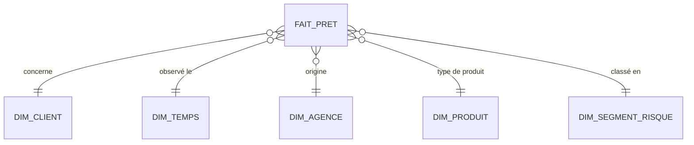
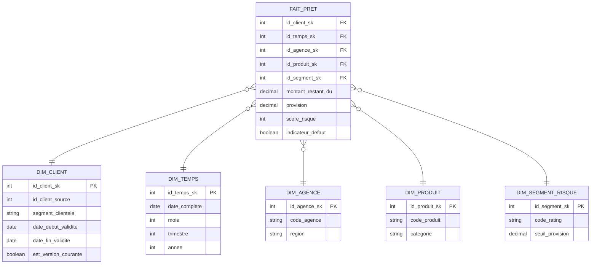

# Risque de crédit — OLAP

Entrepôt pour la direction des risques : évolution du portefeuille de prêts, taux de défaut par segment/produit/agence/période, calcul des provisions. Alimenté par ETL nocturne depuis les systèmes OLTP (dont `finance/oltp-comptes-bancaires`) — aucune écriture interactive ici, que des lectures agrégées.

Grain retenu : **un prêt, un jour d'observation**.

## Modèle conceptuel (étoile)

Toutes les dimensions sont en 1,n vers le fait. On modélise ici des axes d'analyse, pas des règles de gestion — c'est la différence avec un MCD côté OLTP.

## Modèle logique

Deux choix qui font la différence avec le modèle OLTP :

- **clés de substitution** (`*_sk`) plutôt que les clés métier, pour pouvoir historiser sans dépendre du système source ;
- **`dim_client` en SCD2** — on garde la trace du segment de risque du client à chaque date d'observation, ce qui serait inutile (et coûteux) côté transactionnel où seul l'état courant compte.

## Physique

→ [`schema.sql`](schema.sql).

`fait_pret` est partitionnée par `id_temps_sk`, avec les dimensions de référence (agence, produit, segment) volontairement petites et dénormalisées pour rester bon marché à joindre. Le schéma est délibérément redondant par rapport au 3FN du système source : ici on optimise la lecture, pas l'espace disque.
