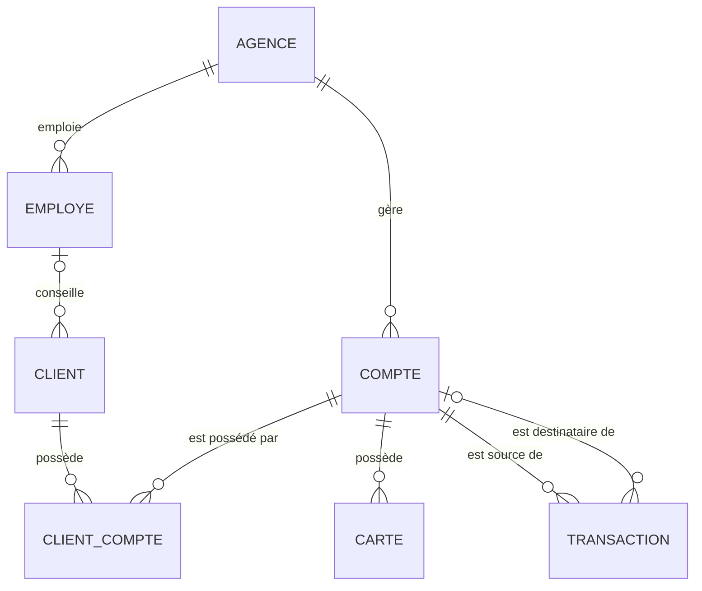
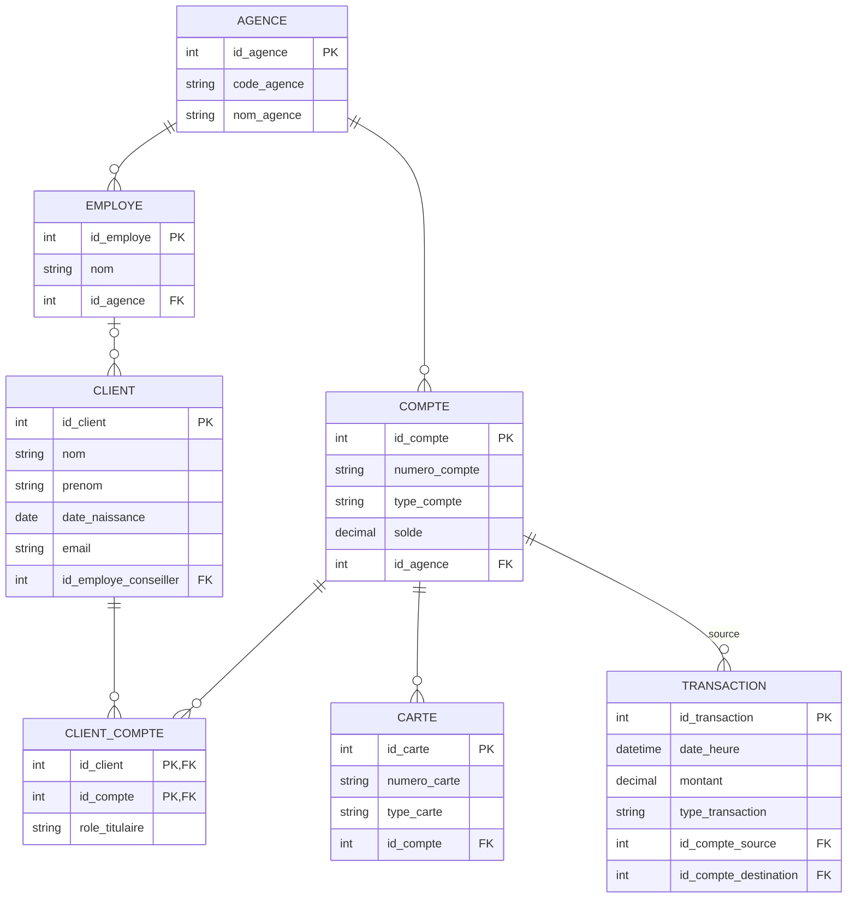

# Comptes bancaires — OLTP

Base transactionnelle d'une banque : ouverture de comptes (parfois joints), cartes associées, et chaque mouvement (dépôt, retrait, virement, paiement) enregistré en temps réel. Le point sensible : un virement doit débiter et créditer dans la même transaction, sans jamais perdre de cohérence.

## MCD

| Entité 1 | Association | Entité 2 | Card. E1 | Card. E2 |
|---|---|---|---|---|
| CLIENT | POSSEDE | COMPTE | 0,n | 1,n |
| AGENCE | GERE | COMPTE | 1,n | 1,1 |
| AGENCE | EMPLOIE | EMPLOYE | 1,n | 1,1 |
| EMPLOYE | CONSEILLE | CLIENT | 0,n | 0,1 |
| COMPTE | EMET_CARTE | CARTE | 1,1 | 0,n |
| COMPTE | EST_SOURCE | TRANSACTION | 1,1 | 0,n |
| COMPTE | EST_DESTINATAIRE | TRANSACTION | 0,1 | 0,n |

CLIENT–COMPTE est une association porteuse (many-to-many, avec `role_titulaire`) : elle donnera une table à part entière au niveau logique.

## MLD

Schéma normalisé (3FN) : `client_compte` absorbe le many-to-many, `transaction` porte deux FK vers `compte` (source obligatoire, destination optionnelle pour les virements internes).

## MPD

→ [`schema.sql`](schema.sql), testé sur PostgreSQL 16.

Points notables du physique :
- `transaction` est partitionnée par mois (`date_heure`) — le volume d'écritures y est le plus élevé, et ça facilite l'archivage/l'extraction vers l'entrepôt du projet `finance/olap-risque-credit`.
- Index limités aux besoins opérationnels réels (numéro de compte, historique par compte) plutôt qu'à tout ce qui pourrait servir un jour — chaque index a un coût à l'écriture.
- Les `CHECK` sur `statut` et `type_*` remplacent des tables de référence pour rester simple ; à faire évoluer en tables si la liste des valeurs grandit.
